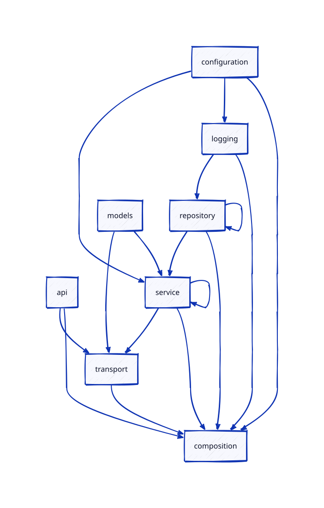

# Conduit API

A production-oriented Go implementation of the
[RealWorld](https://github.com/realworld-apps/realworld) API, implemented as a
gateway and five independently deployable domain services. The existing
frontend keeps using the immutable contract at `http://localhost:8000/api`.

## Quick start

Requirements: Go 1.26, Docker, Docker Compose, `make`, `curl`, and
[Hurl](https://hurl.dev/) for contract tests.

```bash
make doctor
make microservices-check
```

The second command builds the local image, starts PostgreSQL, Kafka, Redis,
frontend, gateway, five domain services and three outbox relays, waits for
readiness, and runs the canonical RealWorld suite. It leaves the stack running
for inspection:

```bash
make microservices-ps
make microservices-logs
make microservices-down
```

Run `make help` at any time for the complete executable command list.

## Runtime architecture

Only gateway is public. It preserves the OpenAPI/RealWorld HTTP surface and
translates requests into synchronous internal gRPC calls. Every domain service
owns its schema and database credentials; sharing one PostgreSQL process in
local development is only a resource-saving implementation detail.

| Component | Public/local port | Owns | Synchronous dependencies |
| --- | ---: | --- | --- |
| gateway | `8000` HTTP | external API composition | all gRPC services |
| auth | `9001` gRPC | credentials and tokens, `conduit_auth` | none |
| profile | `9002` gRPC | users/profiles, `conduit_profile` | Redis cache |
| posts | `9003` gRPC | articles, tags, favorites, `conduit_posts` | profile, subscriptions |
| subscriptions | `9004` gRPC | follows, `conduit_subscriptions` | none |
| comments | `9005` gRPC | comments, `conduit_comments` | posts, profile |
| frontend | `3000` HTTP | server-rendered web application | gateway |
| PostgreSQL | `5432` | five isolated local databases | — |
| Kafka | `29092` | asynchronous domain events | outbox relays |
| Redis | `6379` | disposable profile cache | profile |

The gateway is stateless and owns no database. All persisted domain state is
written through the owning gRPC service.

### gRPC versus Kafka

Use gRPC when the caller needs the answer to complete the current HTTP request:
authentication, profile lookup, article mutation, following/unfollowing and
comment CRUD. A failed synchronous dependency is returned through the existing
RealWorld error mapping.

Kafka is deliberately off the request path. Database triggers append an event
to `outbox_events` in the same transaction as a successful mutation. A relay
publishes it later with an idempotent producer and marks the row delivered.
Consumers are expected to use the supplied inbox primitives for deduplication.

| Topic | Events |
| --- | --- |
| `conduit.subscriptions` | follow created/deleted |
| `conduit.articles` | favorite/unfavorite/article deleted |
| `conduit.profiles` | profile updated |

This gives at-least-once delivery without reporting a successful HTTP write
before PostgreSQL commits. Event details and retry semantics are documented in
[docs/eventing.md](docs/eventing.md).

## Repository map

| Path | Purpose |
| --- | --- |
| `cmd/server` | stateless public HTTP gateway composition root |
| `cmd/auth`, `cmd/profile`, `cmd/posts` | gRPC service entry points |
| `cmd/subscriptions`, `cmd/comments` | gRPC service entry points |
| `cmd/outbox-relay` | reusable PostgreSQL-to-Kafka relay |
| `internal/service` | business logic and narrow repository contracts |
| `internal/transport` | HTTP and gRPC adapters |
| `internal/config`, `internal/logger` | shared runtime configuration and logging |
| `internal/eventing`, `internal/cache` | Kafka outbox/inbox infrastructure and Redis cache |
| `proto` | protobuf sources; generated Go is under `internal/gen/grpc` |
| `services/*/migrations` | database migrations owned by each service |
| `migrations/queries` | shared sqlc query inputs used by domain repositories |
| `config` | typed YAML defaults for every executable |
| `deploy/compose` | complete local microservice topology |
| `deploy/kubernetes/base` | HA-oriented Kubernetes base |
| `deploy/kubernetes/overlays/kind` | one-replica, low-request laptop overlay |
| `deploy/kubernetes/jobs` | database migrations and Kafka topic creation |
| `apitests` | immutable upstream RealWorld Hurl suite |

`api/open-api.yml` and `apitests/` mirror upstream and must not be edited to fit
the implementation.

## Docker Compose workflows

### Complete microservice topology

```bash
make microservices-up       # build, start, migrate, create topics, wait
make microservices-test     # 13 Hurl files / 154 HTTP requests
make microservices-ps       # containers and health
make microservices-topics   # verify Kafka topics
make microservices-outbox   # count unpublished events per producer DB
make microservices-logs     # follow all logs; Ctrl-C does not stop services
make microservices-down     # preserve local data
```

To run just PostgreSQL, Kafka, and Redis while developing services directly:

```bash
make microservices-platform-up
```

`make microservices-reset` is intentionally separate because it removes all
Compose volumes and therefore deletes local PostgreSQL, Kafka, and Redis data.
On small Docker Desktop installations, run either Compose or kind at one time:
two Kafka brokers plus both application topologies can exhaust the VM memory.

Host ports can be changed without editing YAML:

```bash
GATEWAY_PORT=8080 POSTGRES_PORT=55432 KAFKA_PORT=39092 \
  REDIS_PORT=16379 make microservices-up
```

When the gateway port changes, pass the test address explicitly:

```bash
GATEWAY_HOST=http://localhost:8080 make microservices-test
```

## Local Kubernetes with kind

No global kind or kubectl installation is required. Make downloads pinned
binaries into ignored `.tools/bin`, creates `kind-conduit-microservices`, loads
`conduit:local`, deploys the laptop overlay, runs all migrations and waits for
every rollout.

```bash
make k8s-check     # deploy everything and run the RealWorld suite
make k8s-status    # inspect pods, services, jobs, HPA and PDB
make k8s-logs      # follow application logs
make k8s-down      # delete the cluster and its data
```

Individual lifecycle commands are also available:

```bash
make k8s-tools
make kind-create
make kind-load
make k8s-up
make k8s-migrate
make k8s-test
```

The base declares three replicas for gateway and every domain service, two
outbox relays, rolling updates, topology spreading, PodDisruptionBudgets, HPA
`3..10`, probes, default-deny NetworkPolicies and a `LoadBalancer` gateway.
The kind overlay keeps the same topology but uses one replica, removes HPA and
lowers CPU/memory requests so it fits on a development laptop. It does not
weaken the production-oriented base.

Render and verify the Kustomize variants without creating a cluster:

```bash
make k8s-validate
ls .artifacts/kubernetes
```

The checked-in Kubernetes Secret and single-node PostgreSQL/Kafka/Redis are for
development. A real environment must supply external secrets, TLS and
authentication, immutable image tags, backups, and highly available managed or
operator-owned stateful systems. Three stateless pods alone do not make the
whole system highly available. See
[docs/microservices-infrastructure.md](docs/microservices-infrastructure.md).

## Configuration

Every executable starts from `cmd/<name>`, accepts `--config` and `--addr`
where applicable, loads typed YAML defaults through the repository's existing
`cleanenv` configuration style, and allows environment variables to override
them. Compose and Kubernetes already provide the correct service-specific
values.

Common variables:

| Variable | Purpose |
| --- | --- |
| `LOG_LEVEL`, `LOG_FORMAT` | structured logger verbosity and `text`/`json` output |
| `AUTH_JWT_SECRET` | JWT signing secret, at least 32 bytes |
| `AUTH_PASSWORD_PEPPER` | password pepper, at least 16 bytes |
| `LOCAL_AUTH_JWT_SECRET` | Compose-only JWT override; has a valid development default |
| `LOCAL_AUTH_PASSWORD_PEPPER` | Compose-only pepper override; has a development default |
| `*_DB_DSN` | database connection owned by one service |
| `*_GRPC_ADDR` / `*_GRPC_TARGET` | gRPC listener or client target |
| `KAFKA_BROKERS` | comma-separated Kafka brokers |
| `REDIS_ADDR`, `PROFILE_REDIS_ADDR` | Redis endpoint |
| `HTTP_ALLOWED_ORIGINS` | comma-separated CORS allowlist |

The development defaults are not production credentials. `.env` is loaded by
Make for local overrides and is ignored by Git. Compose launch targets use the
separate `LOCAL_AUTH_*` values so unrelated values in `.env` cannot make the
auth service restart; set those variables explicitly when custom local
credentials are needed.

## Development and quality commands

```bash
make test          # unit tests
make vet           # go vet
make check         # tests, vet, protobuf lint, architecture lint
make quality       # lint, architecture rules, coverage >= 95.1%
make generate      # OpenAPI, protobuf, sqlc, mocks, metrics wrapper, Wire
make grpc-breaking # protobuf compatibility against main when a baseline exists
make arch-graph    # regenerate docs/architecture.svg
make badges        # report-card and handwritten LOC badges
```

Generated sources are not edited by hand. SQL lives in query files, service
interfaces stay narrow, and the dependency rules in `.go-arch-lint.yml` keep
transport, service and repository layers separate.



The canonical integration runner is:

```bash
HOST=http://localhost:8000 bash apitests/run-hurl-tests.sh
```

It uses a unique identifier and serial execution. Do not replace it with a
modified local suite when reporting compatibility.

## Observability and troubleshooting

Gateway metrics are at `http://localhost:8000/metrics`. Compose exposes outbox
relay metrics on `9101`, `9102`, and `9103`. Metrics use bounded labels only;
example PromQL is in [docs/metrics.md](docs/metrics.md).

If startup fails:

1. Run `make doctor`, then `make microservices-ps` or `make k8s-status`.
2. Inspect `make microservices-logs` or `make k8s-logs`.
3. Check for another process using ports `8000`, `5432`, `6379`, `9001..9005`
   or `29092`.
4. Use `make microservices-reset` only when losing local data is acceptable.
5. For kind port-forward failures, inspect `.artifacts/gateway-port-forward.log`.

## CI status and releases

[](https://github.com/iampavelkozlov/conduit/actions/workflows/lint.yml)
[](https://github.com/iampavelkozlov/conduit/actions/workflows/tests.yml)
[](https://github.com/iampavelkozlov/conduit/actions/workflows/coverage.yml)
[](https://github.com/iampavelkozlov/conduit/actions/workflows/generated.yml)
[](https://github.com/iampavelkozlov/conduit/actions/workflows/build.yml)
[](https://github.com/iampavelkozlov/conduit/actions/workflows/release.yml)
[](https://github.com/iampavelkozlov/conduit/actions/workflows/coverage.yml)

Pushing a semantic-version tag publishes release archives, checksums and the
multi-platform container image:

```bash
git tag -a v1.0.0 -m "v1.0.0"
git push origin v1.0.0
```
