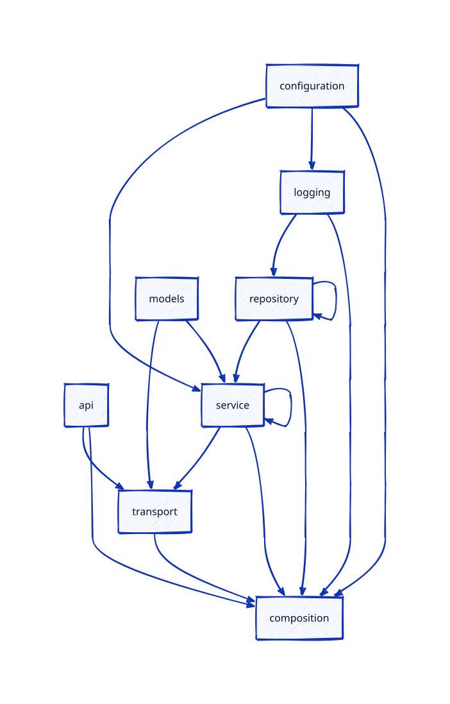

# Conduit

A production-oriented implementation of the
[RealWorld](https://github.com/realworld-apps/realworld) application. The
repository contains a Go/PostgreSQL API and a Vue 3 frontend with authentication,
profiles, articles, comments, tags, favorites, personalized feeds, theming, and
sanitized rich-text authoring.

[](https://github.com/iampavelkozlov/conduit/actions/workflows/build.yml)
[](https://github.com/iampavelkozlov/conduit/actions/workflows/tests.yml)
[](https://github.com/iampavelkozlov/conduit/actions/workflows/lint.yml)
[](https://github.com/iampavelkozlov/conduit/actions/workflows/coverage.yml)
[](https://github.com/iampavelkozlov/conduit/actions/workflows/generated.yml)

## Contract

The external API is defined by the canonical RealWorld specification:

- `api/open-api.yml` is byte-for-byte identical to the upstream OpenAPI file.
- `apitests/` is byte-for-byte identical to the upstream Hurl suite.
- Local behavior is changed in implementation code, never by weakening the
  contract or its tests.

Run `make verify-contract` to clone the current upstream source into a temporary
directory and compare both inputs exactly. Set `REALWORLD_REF` when deliberately
checking another upstream branch or tag.

## Stack

- Go 1.26, Chi, `oapi-codegen`, Wire
- PostgreSQL 16, `pgx`, `sqlc`, Goose
- Prometheus metrics and structured logging
- Hurl integration tests
- Vue 3, TypeScript, Vite, Pinia, Vue Router
- Tailwind CSS, shadcn-vue, Tiptap, Vitest

## Architecture

HTTP transport depends on application services. Services own narrow repository
interfaces, while PostgreSQL implementations remain behind those interfaces.
Read models are assembled in services from bounded batch queries to avoid N+1
access and oversized joins. Transaction lifecycle stays in repository
infrastructure and is exposed to services through `Transactions.WithTx`.

The dependency contract lives in `.go-arch-lint.yml` and its generated graph is
`docs/architecture.svg`.



Product scope and non-goals are documented in
[`docs/product.md`](docs/product.md). Durable architectural decisions belong in
[`docs/adr/`](docs/adr/README.md).

## Local development

Requirements: Go, Node.js 24, npm, Git, Docker with Compose, Hurl, and `make`.

```bash
cp .env.example .env
# Replace every change-me value.
docker compose up -d --build
```

The application is served through nginx at `https://<PUBLIC_HOST>`. The frontend
container creates a local certificate authority under `.data/certs`; install
`.data/certs/ca.crt` as a trusted root on client devices when needed.

For hot reload, run the API on port `8000`, then start Vite:

```bash
go run ./cmd/server --addr :8000
make frontend-install
npm --prefix frontend run dev
```

The Vite server uses `http://localhost:5173` and proxies `/api` and `/internal`
to the Go server.

Runtime defaults live in `config/config.yaml` and can be overridden with
environment variables. See `.env.example` for the supported local settings.

## Development commands

```bash
make test                 # Go tests with race detector
make quality              # Go lint, architecture lint, and coverage gate
make verify-backend       # Full backend verification
make verify-frontend      # Vitest, typecheck, build, generated type check
make verify-generated     # Regenerate and diff every generated artifact
make verify-contract      # Compare OpenAPI and Hurl files with upstream
make verify               # All repository-local verification gates
make test-integration     # Canonical Hurl suite; server must listen on :8000
```

Generation targets:

```bash
make generate             # OpenAPI server, sqlc, mocks, wrapper, Wire
make frontend-generate    # TypeScript API schema
make arch-graph           # Architecture SVG
make badges               # Report-card and handwritten LOC badges
```

`make verify-generated` intentionally fails when regeneration changes tracked
files. Review and commit those generated changes together with their inputs.

## AI-assisted development

The repository separates human and agent guidance by responsibility:

| Path | Purpose |
| --- | --- |
| `AGENTS.md` | Mandatory repository invariants, architecture, generation, and verification rules |
| `frontend/AGENTS.md` | More specific frontend conventions when work starts inside `frontend/` |
| `.agents/skills/` | Reusable task workflows loaded only when relevant |
| `.codex/config.toml` | Project-scoped Codex multi-agent limit |
| `.codex/agents/` | Read-only specialist reviewers |
| `docs/product.md` | Product intent, scope, quality principles, and non-goals |
| `docs/adr/` | Durable architectural decisions and their rationale |
| `docs/ai-evals.md` | Prompt scenarios for checking skill routing and safety behavior |
| `Makefile` and CI | Executable verification; the final authority for mechanical checks |

Codex discovers repo-scoped skills under `.agents/skills/`. They may be selected
automatically from their descriptions or invoked explicitly with `$skill-name`.
See the [OpenAI skill documentation](https://learn.chatgpt.com/docs/build-skills.md)
for the underlying format.

Project agent configuration is loaded for a trusted checkout. Start a new Codex
session after changing `.codex/` files. The project caps spawned reviewers at
three and intentionally does not pin a model, so agents inherit the model and
reasoning level selected for the parent task.

### Available skills

#### `$implement-api-operation`

Use for implementing or changing an HTTP operation already present in the
canonical RealWorld schema. It traces the generated interface through transport,
service, models, repository calls, tests, generation, and Hurl verification.

```text
$implement-api-operation implement the missing behavior for updating an article
```

It deliberately refuses to invent a local endpoint that is absent from the
upstream contract.

#### `$add-sqlc-query`

Use for new or changed query SQL, migrations, batch repository methods, and
their generated interfaces, metrics wrapper, mocks, and service tests.

```text
$add-sqlc-query add the minimal batch lookup needed for this feed
```

The workflow preserves table-scoped reads, narrow projections, UUIDs,
transactions, and the no-N+1 rule.

#### `$verify-change`

Use before completing work or when selecting the correct gates for a diff. It
maps changed areas to backend, frontend, generated, contract, and integration
verification and reports anything that could not be run.

```text
$verify-change verify the current working tree and summarize every gate
```

#### `$review-change`

Use for a read-only review. When subagents are available, it delegates three
independent passes and consolidates evidence-backed findings:

- `contract_reviewer` checks RealWorld and HTTP behavior;
- `architecture_reviewer` checks layers, SQL, batching, transactions, UUIDs,
  generated boundaries, and metrics;
- `test_reviewer` checks backend and frontend coverage gaps.

```text
$review-change review this branch against main with all specialist reviewers
```

The primary agent owns implementation edits. Reviewer agents are configured
with a read-only sandbox and should not be used as parallel writers. Codex can
also be asked directly to spawn and coordinate them; see the
[subagent documentation](https://learn.chatgpt.com/docs/agent-configuration/subagents.md).

When instructions or skills change, exercise the representative prompts in
[`docs/ai-evals.md`](docs/ai-evals.md) from a clean session. Write-capable cases
should run in a disposable branch or worktree.

### Goals, memory, and command rules

- Use `/goal` for a long implementation whose outcome, constraints, and
  verification criteria should remain attached to the chat. It is runtime task
  state, not a repository file.
- Codex memory is optional personal state configured in the client. Required
  team knowledge stays in `AGENTS.md` or checked-in documentation; the
  repository intentionally has no `memory.md`.
- Codex `.rules` files govern command execution policy, not coding conventions.
  The repository intentionally has no project rules file; destructive actions
  remain constrained by `AGENTS.md`, the active sandbox, and user approval.

## Integration tests

Start PostgreSQL, apply migrations, and run the API on the port expected by the
canonical suite:

```bash
docker compose up -d postgres
make migrate
go run ./cmd/server --addr :8000
```

In another shell:

```bash
make test-integration
```

The runner generates a unique identifier and executes Hurl files serially. Stop
the test server when it finishes.

## Observability

The API exports bounded Prometheus metrics for HTTP traffic, recovered panics,
and repository calls. Example dashboards and PromQL queries are documented in
[`docs/metrics.md`](docs/metrics.md).

## Releases

Backend and frontend are versioned independently with `backend-v*` and
`frontend-v*` tags. Release workflows publish archives, checksums, GitHub
Releases, multi-platform GHCR images, and provenance attestations. Stable tags
also advance major, major/minor, and `latest` image aliases.
